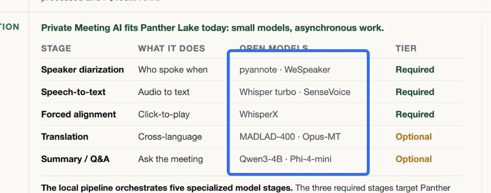

# audiolabx2v3 / llm-init 工作日志 — 2026-07-16

> 主线：给 `audiolabx2v3`（llm-init 音频代理版）的 translate 能力做**第二翻译范例（m2m100，可商用）**，
> 并走完 RULE-1 全量重建上线。晚上网络不稳，m2m100 权重仍在下载，验证顺延至明天。

---

## 一、第二翻译：translate.py 改为「适配器架构」（加法，不是改）

思想钢印（本次牢记）：**加法 / 自适应 / 从 `MODEL_NAME` 自动判别 / 绝不新增 clone 表单 ENV /
旧 NLLB 必须继续能跑（只是不主动提供）**。

- 文件：`audiolabx2v3/templates/wrappers.yaml` 的 `translate.py`。
- 外部 API **永远是 FLORES-200**（`eng_Latn`/`zho_Hans`），网关/Demo 一行不用改；各 adapter
  内部自行做 FLORES↔本模型码本的映射。
- adapter 由 `MODEL_NAME` 自动选（与 STT 从模型名自动选引擎同一套思想），检测优先级
  `[M2M100Adapter, NLLBAdapter]`，另有文件嗅探兜底；高级 `TRANSLATE_ADAPTER` 仅走 olaresEnv，
  **永不进 clone 表单**（RULE-2 完好）。
  - `M2M100Adapter`（MIT，**商用默认**）：`transformers` 的 M2M100Tokenizer + `sentencepiece`
    （首次加载按需 pip，沿用 embed/enhance 模式）；FLORES→ISO 前缀映射（103 语言）；
    按官方 ctranslate2 recipe：`convert_ids_to_tokens(encode(text))` 作源、
    `target_prefix=[lang_code_to_token[tgt]]`、解码丢弃 `hyp[0][1:]` 的强制语言 token。
  - `NLLBAdapter`（默认/回退，**与旧 wrapper 字节级一致**）：`tokenizers` + `tokenizer.json`；
    NLLB 码本本就是 FLORES-200，无需映射。现有 NLLB 实例完全不受影响。
- 句子切分 + 无空格连接（zho/jpn/… 用 `""` 拼）逻辑保持模型无关（按外部 FLORES target 判断）。
- `engine.yaml`：只更新了 translate 的注释（说明现在多模型自适应），**映射不变**——两者同为
  CPU ctranslate2、同一 pyannote 镜像，加第三个翻译只需再加一个 adapter，连"多引擎"口子也留好了。

### 授权结论（之前已确认）
克隆出的模型里，**只有 NLLB-200 是 CC-BY-NC 不可商用**；其余 MIT/Apache/NVIDIA-Open/CC-BY-4.0
均可商用。故 m2m100 作为对外默认，NLLB 仅保留给用户自行选用。

### 校验
- `helm template` 渲染干净（`userspace.appCache` nil 报错是 Olares 安装期注入，与本改动无关）。
- 抽取渲染后的 9 个 wrapper 全部 `py_compile` OK；translate.py 249 行、103 条语言映射。

---

## 二、RULE-1 全量重建上线（已完成到"克隆"这步）

1. 重打 `audiolabx2v3-1.0.0.tgz`（含 m2m100 adapter；旧包备份为 `.tgz.bak-*`）。
2. `market uninstall` 全部 10 个 clone → 轮询确认全部消失。
3. `market delete audiolabx2v3` → `market upload` 新 tgz。
4. 重 clone 11 个（title + 恰好 4 env）：

- **10 个原实例哈希全部原样复现 → public URL 不变 → 无需重指 provider：**
  `0263ef`(STT Whisper) `93e848`(STT Qwen3ASR) `b0c2ed`(STT Stream) `9c4797`(Diar Stream)
  `818606`(Diar) `dd1ed9`(VAD) `53f4c2`(**NLLB** Translate) `cdcb44`(Embed)
  `0e4d03`(Enhance) `c84c8e`(Align)。
- **新增第二翻译**：`AudioX2 Translate m2m100` → `audiolabx2v354d617`
  （NS `audiolabx2v354d617-shared`），env：
  `MODEL_SOURCE=hf://entai2965/m2m100-1.2B-ctranslate2`、`MODEL_NAME=m2m100-1.2B`、
  `MODEL_MODE=translate`、`AUDIO_REQUIRED_GPU_MEMORY=0`（CPU ct2）。

台账 `audiolabx2v3-LEDGER.md` 已回填以上。

---

## 三、m2m100 验证：顺延到明天（EOD 状态）

- `llminit` pod **1/1**；引擎 pod **0/1 PodInitializing**，卡在 initContainer 等下载
  sentinel（`/run/llm-init/model_download_finish`）。
- llm-init 日志：3 个小文件秒下完，随后大文件 `model.bin`（~2.4GB）下载期间报过一次
  **可重试的 HF 网络错误**（`hfwrap exit=-1 (retriable)`）→ llm-init 自动重启、从缓存续传
  重试（`retry_count=1`）。第二次尝试已跑很久且 pod 未再重启，判断是**晚上 HF 限速/慢**，
  非代码问题。用户指示：**让它挂着下，明天继续**。
- 说明：HF 缓存是 `appCommon/huggingface` 跨 clone 共享，所以只有全新的 m2m100 需要真下；
  其余 10 个都命中缓存、秒起。
- `olares-cli cluster container` 只有 `env/list/logs`，**无 exec**；HF 缓存在远端节点，
  本地看不到 blob 大小，只能靠日志/pod 状态判断。

### 明天验证 m2m100 的做法
1. `olares-cli cluster pod list -n audiolabx2v354d617-shared` 等引擎 **1/1**
   （下完模型 → 引擎起 → 首次 pip 装 transformers/sentencepiece → 加载）。
2. 引擎日志应见 `translate ready: adapter=m2m100 model=... on cpu`。
3. 功能测：**public URL 需向用户要**（RULE-0，olares-cli 不给）。拿到后：
   `POST https://<hex>.olarestest003.olares.com/v1/translate`
   body `{"text":"Hello world. How are you?","target":"zho_Hans"}` →
   期望返回中文（`adapter":"m2m100"`）。再测 `zho_Hans→eng_Latn` 等反向。

---

## 四、明天的三件事（用户指定）

### (1) 试新的翻译（m2m100）
按上面「明天验证 m2m100」跑通直连；与 NLLB(`53f4c2`) 对比质量；决定是否给 m2m100 建网关
provider（对外默认走 m2m100）。

### (2) 新增「智能摘要 / Summary」功能 —— 需要具体设计
参考用户给的 Private Meeting AI 流程图（Panther Lake 本地五阶段流水线）：

- 图中五阶段：Diarization(pyannote/WeSpeaker)、STT(Whisper turbo/SenseVoice)、
  Forced alignment(WhisperX)、**Translation(MADLAD-400/Opus-MT，Optional)**、
  **Summary/Q&A(Qwen3-4B/Phi-4-mini，Optional)**。我们前四类能力已具备；Summary 是新增。
- 待设计点（明天定方案，勿急）：
  - 引擎/模型选型：Summary/Q&A 属文本 LLM（Qwen3-4B / Phi-4-mini 之类）。是复用现有
    llm gateway 的通用 chat 模型，还是像音频那样在 audiolabx2v3 base 下开一个新 `mode`？
    倾向：摘要是纯文本 LLM，走 llm-gateway 现成 chat 通道更自然，audio base 不必背这个。
  - 输入契约：摘要吃"转写全文（可带说话人/时间戳）"→ 产出结构化纪要（要点/待办/决议/QA）。
  - 与 Demo 的衔接：`audiostudioxdemo` 加"生成纪要 / 向会议提问"面板。
  - 自适应/多模型理念延续（可换摘要模型、可多引擎）。

### (3) 进一步优化「分段转写」效率 —— 做一个"测试版"批量接口看效果
- 现状：长音频按 VAD/窗口切段后逐段 STT，段间串行开销大。
- 目标：给 STT 引擎（faster-whisper 优先，它 batched 管线天然适合）加一个**测试版批量接口**
  （一次请求收多段音频 / 或服务端并行 batched decode），对比逐段串行的吞吐与时延。
- 注意：属引擎改动（wrappers/engine），要走 RULE-1 重建；先在测试版接口上验证收益再定。

---

## 五、状态 / 未提交

- 未 commit（按惯例等指令）。本次改动：`audiolabx2v3`（wrappers.yaml + engine.yaml 注释 + 重打 tgz）、
  `audiolabx2v3-LEDGER.md`、本 WORK_LOG + 流程图。
- 代码与 chart 均已上线（11 clone 已发起）；唯一未完成 = m2m100 权重下载 + 功能验证（网络原因顺延）。
